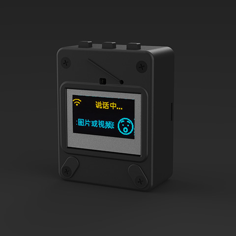
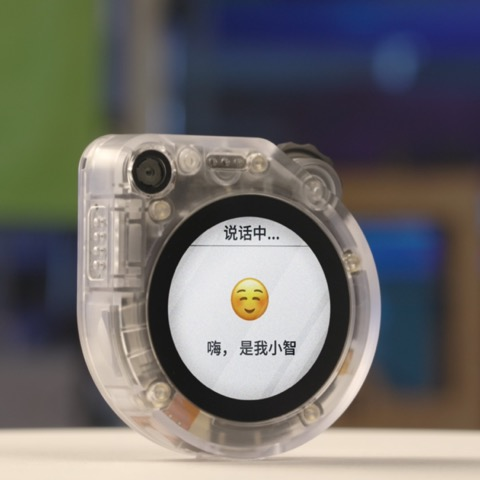

# ESP32-C3(C2)+VB6824 x 小智 AI 

- 首先致谢虾哥的开源项目：https://github.com/78/xiaozhi-esp32
- 其次致谢：https://github.com/xinnan-tech/xiaozhi-esp32-server

## 项目简介

👉 [ESP32+SenseVoice+Qwen72B打造你的AI聊天伴侣！【bilibili】](https://www.bilibili.com/video/BV11msTenEH3/)

👉 [给小智装上 DeepSeek 的聪明大脑【bilibili】](https://www.bilibili.com/video/BV1GQP6eNEFG/)

特色：

1. VB6824 作为AI语音芯片负责语音打断唤醒和离线语音识别，同时负责录音+音频播放;ESP32-C3(C2)芯片负责接入在线大模型+CozyLife APP。
2. VB6824 UART TX输出降噪后的高信噪比的录音，接到ESP32-C3(C2)芯片UART RX，RX收到的数字音频发给在线大模型。
3. VB6824 从DAC处，做回声信号的采集，接入到PA0/PA1（LINEIN）作为AEC的回采信号。
4. VB6824 语音识别后把识别结果通过UART TX发给ESP32-C3(C2)芯片。

本项目是一个开源项目，以 MIT 许可证发布，允许任何人免费使用，并可以用于商业用途。

我们希望通过这个项目，能够帮助更多人入门 AI 硬件开发，了解如何将当下飞速发展的大语言模型应用到实际的硬件设备中。无论你是对 AI 感兴趣的学生，还是想要探索新技术的开发者，都可以通过这个项目获得宝贵的学习经验。

欢迎所有人参与到项目的开发和改进中来。如果你有任何想法或建议，请随时提出 Issue 或加入群聊。

学习交流 QQ 群：376893254

## 已实现功能

- Wi-Fi / ML307 Cat.1 4G
- BOOT 键唤醒和打断，支持点击和长按两种触发方式
- 离线语音唤醒 [ESP-SR](https://github.com/espressif/esp-sr)
- 流式语音对话（WebSocket 或 UDP 协议）
- 支持国语、粤语、英语、日语、韩语 5 种语言识别 [SenseVoice](https://github.com/FunAudioLLM/SenseVoice)
- 声纹识别，识别是谁在喊 AI 的名字 [3D Speaker](https://github.com/modelscope/3D-Speaker)
- 大模型 TTS（火山引擎 或 CosyVoice）
- 大模型 LLM（Qwen, DeepSeek, Doubao）
- 可配置的提示词和音色（自定义角色）
- 短期记忆，每轮对话后自我总结
- OLED / LCD 显示屏，显示信号强弱或对话内容
- 支持 LCD 显示图片表情
- 支持多语言（中文、英文）

## 硬件部分

### 面包板手工制作实践

详见飞书文档教程：

👉 [《小智 AI 聊天机器人百科全书》](https://ccnphfhqs21z.feishu.cn/wiki/F5krwD16viZoF0kKkvDcrZNYnhb?from=from_copylink)

面包板效果图如下：

### 已支持的开源硬件

- <a href="https://oshwhub.com/li-chuang-kai-fa-ban/li-chuang-shi-zhan-pai-esp32-s3-kai-fa-ban" target="_blank" title="立创·实战派 ESP32-S3 开发板">立创·实战派 ESP32-S3 开发板</a>
- <a href="https://github.com/espressif/esp-box" target="_blank" title="乐鑫 ESP32-S3-BOX3">乐鑫 ESP32-S3-BOX3</a>
- <a href="https://docs.m5stack.com/zh_CN/core/CoreS3" target="_blank" title="M5Stack CoreS3">M5Stack CoreS3</a>
- <a href="https://docs.m5stack.com/en/atom/Atomic%20Echo%20Base" target="_blank" title="AtomS3R + Echo Base">AtomS3R + Echo Base</a>
- <a href="https://docs.m5stack.com/en/core/ATOM%20Matrix" target="_blank" title="AtomMatrix + Echo Base">AtomMatrix + Echo Base</a>
- <a href="https://gf.bilibili.com/item/detail/1108782064" target="_blank" title="神奇按钮 2.4">神奇按钮 2.4</a>
- <a href="https://www.waveshare.net/shop/ESP32-S3-Touch-AMOLED-1.8.htm" target="_blank" title="微雪电子 ESP32-S3-Touch-AMOLED-1.8">微雪电子 ESP32-S3-Touch-AMOLED-1.8</a>
- <a href="https://github.com/Xinyuan-LilyGO/T-Circle-S3" target="_blank" title="LILYGO T-Circle-S3">LILYGO T-Circle-S3</a>
- <a href="https://oshwhub.com/tenclass01/xmini_c3" target="_blank" title="虾哥 Mini C3">虾哥 Mini C3</a>
- <a href="https://oshwhub.com/movecall/moji-xiaozhi-ai-derivative-editi" target="_blank" title="Movecall Moji ESP32S3">Moji 小智AI衍生版</a>
- <a href="https://github.com/WMnologo/xingzhi-ai" target="_blank" title="无名科技Nologo-星智-1.54">无名科技Nologo-星智-1.54TFT</a>
- <a href="https://github.com/WMnologo/xingzhi-ai" target="_blank" title="无名科技Nologo-星智-0.96">无名科技Nologo-星智-0.96TFT</a>
- <a href="https://www.seeedstudio.com/SenseCAP-Watcher-W1-A-p-5979.html" target="_blank" title="SenseCAP Watcher">SenseCAP Watcher</a>

  
  
  
  
  
  
  
  
  
  
  
  

## 固件部分

### 免开发环境烧录

新手第一次操作建议先不要搭建开发环境，直接使用免开发环境烧录的固件。

固件默认接入 [xiaozhi.me](https://xiaozhi.me) 官方服务器，目前个人用户注册账号可以免费使用 Qwen 实时模型。

👉 [Flash烧录固件（无IDF开发环境）](https://ccnphfhqs21z.feishu.cn/wiki/Zpz4wXBtdimBrLk25WdcXzxcnNS) 

<<<<<<< HEAD
## 离线唤醒词
### 唤醒词
| 中文唤醒词           | 英文唤醒词         |
| ------------------ | ---------------- |
| 小艾小艾            | Hey Alice        |
| 你好小智            |                  |
=======
- Cursor 或 VSCode
- 安装 ESP-IDF 插件，选择 SDK 版本 5.3 或以上
- Linux 比 Windows 更好，编译速度快，也免去驱动问题的困扰
- 使用 Google C++ 代码风格，提交代码时请确保符合规范
>>>>>>> main

### 机器人

<<<<<<< HEAD
| 中文指令           | 英文指令         |
| ------------------ | ---------------- |
| 再见/不聊了        | Peace out        |
| 站起来/站立        | Stand up         |
| 坐下               | Sit down         |
| 趴下               | Get down         |
| 转个圈             | Turn around      |
| 打个滚             | Roll over        |
| 去尿尿/尿尿去      | Go pee-pee       |
| 去睡觉/睡觉去      | Go to sleep      |
| 装死               | Play dead        |
| 秀一个/跳个舞/跳舞 | Show time        |
| 来个绝活           | Do stunts        |
| 倒立旋转           | Handstand spin   |
| 前进               | Move forward     |
| 后退               | Move backward    |
| 左转/向左转        | Turn left        |
| 右转/向右转        | Turn Right       |
| 过来               | Come here        |
| 走开/滚开/滚蛋     | Go away          |
| 匍匐前进           | Crawling forward |
| 滑步               | Sliding step     |
| 我讨厌你           | I hate you       |

### 灯光

| 中文指令 | 英文指令             |
| -------- | -------------------- |
| 打开灯光 | Turn On The Light    |
| 关闭灯光 | Switch Off The Light |
| 调亮灯光 | Brighten The Light   |
| 调暗灯光 | Dim The Light        |
| 七彩模式 | Colorful Mode        |
| 音乐模式 | Music Mode           |
| 白色灯光 | White Light          |
| 黄色灯光 | Yellow Light         |
| 自然灯光 | Natural Light        |
| 红色灯光 | Red Light            |
| 绿色灯光 | Green Light          |
| 蓝色灯光 | Blue Light           |
| 橙色灯光 | Orange Light         |
| 青色灯光 | Cyan Light           |
| 紫色灯光 | Purple Light         |
=======
## 智能体配置

如果你已经拥有一个小智 AI 聊天机器人设备，可以登录 [xiaozhi.me](https://xiaozhi.me) 控制台进行配置。

👉 [后台操作视频教程（旧版界面）](https://www.bilibili.com/video/BV1jUCUY2EKM/)

## 技术原理与私有化部署

👉 [一份详细的 WebSocket 通信协议文档](docs/websocket.md)

在个人电脑上部署服务器，可以参考另一位作者同样以 MIT 许可证开源的项目 [xiaozhi-esp32-server](https://github.com/xinnan-tech/xiaozhi-esp32-server)
>>>>>>> main

### 音乐

| 中文指令 | 英文指令      |
| -------- | ------------- |
| 播放音乐 | Play music    |
| 暂停播放 | Pause playing |
| 停止播放 | Stop playing  |
| 上一首   | Previous song |
| 下一首   | Next song     |

### 配网

| 中文指令 | 英文指令      |
| -------- | ------------- |
| 开始配网 | Start pairing |
| 停止配网 | Stop pairing  |

## 更多问题

技术支持微信：andy433928

VB6824：https://item.taobao.com/item.htm?id=891592447743& 

C2开发板：https://item.taobao.com/item.htm?id=688271301869

C3开发板：https://item.taobao.com/item.htm?id=652593406663&skuId=5184792378516：
